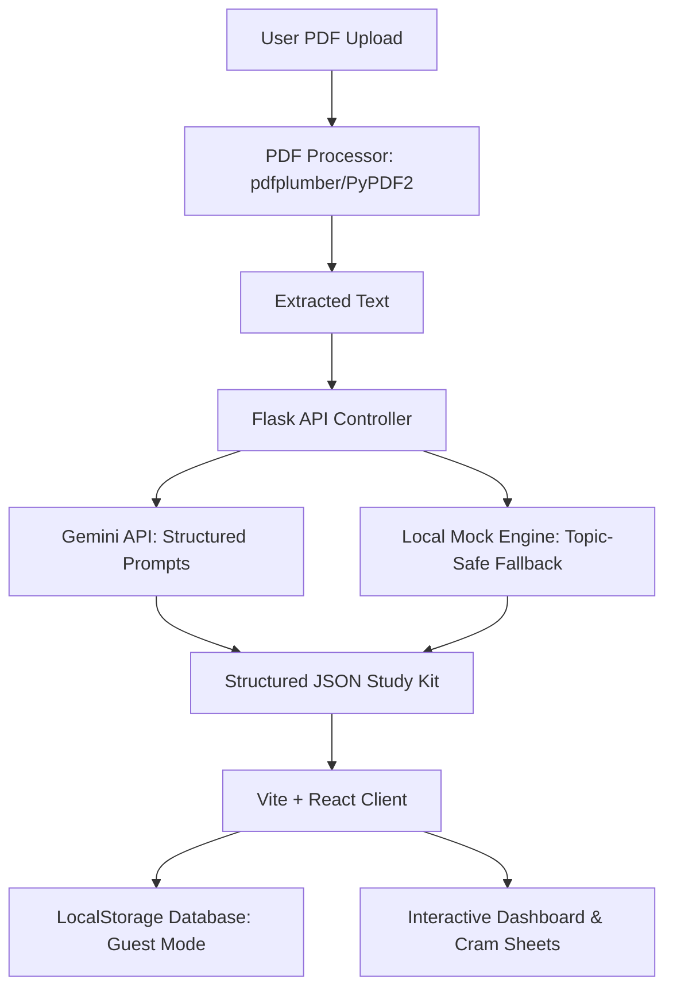
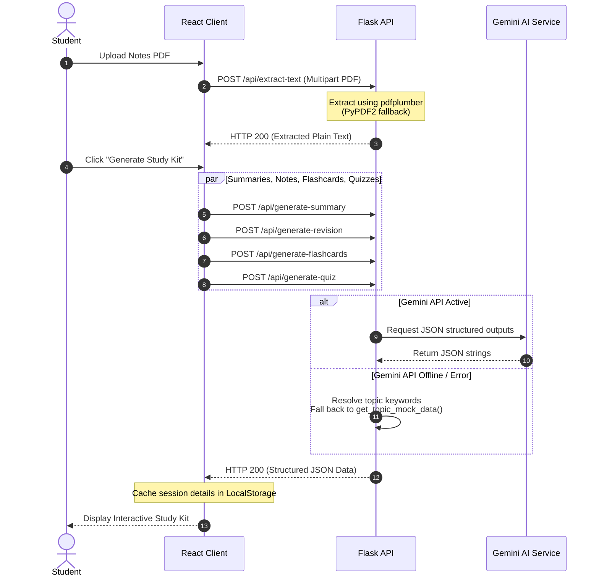

# 🧠 PrepWise AI — Smart Exam Preparation Assistant

[](https://react.dev/)
[](https://www.typescriptlang.org/)
[](https://flask.palletsprojects.com/)
[](https://ai.google.dev/)
[](https://tailwindcss.com/)
[](https://vite.dev/)
[](https://opensource.org/licenses/MIT)

> **"Transform lecture notes into personalized exam success."**

PrepWise AI is a focused, production-grade learning copilot designed specifically for college students. Instead of acting as a generic conversational chatbot, PrepWise AI targets the pain points of academic preparation: compiling high-yield summaries, formatting interactive study sheets, organizing quiz logs, charting learning insights, and planning revision schedules around critical exam dates.



---

## 📸 Demo & User Journey

### User Journey
1. **Upload**: Drag and drop a lecture notes PDF onto the clean, glassmorphic upload interface.
2. **Review**: Watch the parsing checkpoint system extract text and spin up learning resources.
3. **Engage**: Attempt flashcards, take mock quizzes, consult the context-aware AI tutor, and map out a study plan.
4. **Cram**: Unlock *Night Before Exam Mode* for a high-yield study sheet when time is running out.

| Interface | Showcase Placement |
|---|---|
| **Core Dashboard** |  |
| **Interactive Study Kit** |  |
| **Practice Quiz & Confetti** |  |
| **Night Before Exam Cram Mode** |  |

---

## 🎯 Why PrepWise AI?

College students waste hours of valuable study time manually compiling study aids: copying text into flashcard decks, typing out cheat sheets, and guessing what questions might appear on exams. 

**PrepWise AI eliminates this structural inefficiency.** 

By leveraging generative AI paired with robust local mock fallbacks, it converts raw textbook pages and presentation slides into structured, highly interactive learning kits. It doesn't just answer questions; it acts as a strategic preparation companion that identifies weaknesses, structures study calendars, and provides emergency high-yield revision sheets. The result is a student-first preparation suite that optimizes retention, saves time, and maximizes exam scores.

---

## 🛠️ Features

| Feature | What It Does | Why Students Benefit |
| :--- | :--- | :--- |
| **📄 PDF Notes Upload** | Extracts and structures layout text from multi-page PDFs using a robust fall-through pipeline. | Saves students from manual transcription, making complex slides searchable in seconds. |
| **📝 Smart Summaries** | Formulates detailed study summaries, definitions, formulas, and key concepts. | Condenses 40-page notes into actionable, single-page reference documents. |
| **⚡ Revision Modes** | Toggles notes between a 2-minute overview, standard revision, and exam-night sheets. | Adapts text volume to match the student's study window (from days before to minutes before). |
| **🃏 Flashcards** | Generates beautiful interactive cards utilizing 3D CSS flip animations. | Promotes active recall and self-testing without external application dependencies. |
| **❓ Interactive Quizzes** | Generates MCQs, True/False, and short-answer questions with detailed feedback. | Simulates actual test conditions, highlighting wrong answers with instant explanations. |
| **🧠 AI Tutor** | Contextual chatbot supporting tutoring modes like ELI10 or mixed Tamil-English. | Breaks down dense technical jargon into approachable, friendly, localized explanations. |
| **📊 Learning Insights** | Charts score graphs using Recharts and compiles a custom "Mini Revision Pack." | Automatically redirects study attention to weak spots, converting failure into structured review. |
| **📅 Study Planner** | Builds custom day-by-day schedules mapped around specific exam dates. | Prevents exam-date panic by structuring hours, tasks, and topics into a manageable calendar. |
| **🎯 Night Before Exam Mode** | Structures high-yield cheat sheets, skip-lists, and formula cards for cramming. | Minimizes cognitive overload, focusing only on the highest-probability exam questions. |

---

## ⚡ Signature Feature: Night Before Exam Mode

The **Night Before Exam Mode** is PrepWise AI's premium tool designed for high-stress, limited-time scenarios. When a student enters their remaining cram time (e.g., "3 hours"), the application generates a targeted emergency plan consisting of:

*   🚨 **Must Study**: Highly critical, core scoring topics that the student cannot afford to miss.
*   ✅ **Can Skip**: Marginally tested, complex background topics that are safe to ignore in a cram session.
*   🎯 **Likely Exam Areas**: Frequently tested questions, proofs, or derivations identified from the lecture notes.
*   📋 **Final Revision Checklist**: Quick-recall formulas, index metrics, and warnings against common exam mistakes.

---

## 🏗️ Architecture & Data Flow

PrepWise AI separates concerns across a modern, decoupling-ready architecture:



---

## 💻 Tech Stack Selection

| Technology | Purpose | Reason for Selection |
| :--- | :--- | :--- |
| **React (v19)** | UI Rendering | Facilitates smooth, component-driven layouts and rapid rendering of complex state states. |
| **TypeScript** | Static Type Safety | Eliminates runtime bugs through strong compilation checks, ensuring API request/response integrity. |
| **Vite** | Bundling & Development | Offers lightning-fast Hot Module Replacement (HMR) and optimized Rolldown production builds. |
| **Tailwind CSS (v4)** | Component Styling | Out-of-the-box styling with CSS variables, enabling sleek dark modes and modern glassmorphism. |
| **Flask (Python)** | RESTful API Backend | Light, fast routing engine with native Python compatibility for document processing libraries. |
| **Gemini API** | Generative AI Core | Delivers fast, high-quality semantic extraction and structures answers into JSON using system schemas. |
| **pdfplumber** | PDF Parsing | Provides exact text layout coordinates and handles table formatting better than generic libraries. |
| **LocalStorage** | Data Persistence | Powers a zero-configuration "Guest Mode" experience, keeping data private and local to the browser. |

---

## 📂 Folder Structure

```text
prepwise-ai/
├── backend/
│   ├── temp/                   # Temporary directory for file uploads
│   ├── app.py                  # Main Flask entrypoint, routes, and mock fallback database
│   ├── requirements.txt        # Backend dependencies (Flask, pdfplumber, dotenv, etc.)
│   └── .env                    # Local environment config (secrets)
├── frontend/
│   ├── public/                 # Static assets (Favicons, vector icons)
│   ├── src/
│   │   ├── assets/             # Images and styles
│   │   ├── components/         # Reusable tab controls, timelines, and toggles
│   │   ├── pages/              # Upload notes, Dashboard, Study Kit, Planner, and NightBeforeExam
│   │   ├── services/           # API fetch client and LocalStorage persistence layer
│   │   ├── types/              # TypeScript interfaces for models
│   │   ├── App.tsx             # Main layout frame and navigation router
│   │   └── index.css           # Styling entrypoint linking Tailwind config
│   ├── package.json            # Frontend scripts and dependencies
│   ├── postcss.config.js       # PostCSS plugins mapping
│   ├── tailwind.config.js      # Custom animations, fonts, and dark mode tokens
│   └── vite.config.ts          # Vite bundler parameters
└── .gitignore                  # Root-level ignore mapping (excludes node_modules and .env files)
```

---

## 🚀 Installation & Local Setup

This setup guide assumes you are starting from a clean git clone.

### Prerequisites
*   **Node.js**: v18.0 or higher.
*   **Python**: v3.9 or higher.

### 1. Backend Setup
1.  Navigate into the `backend/` directory:
    ```bash
    cd backend
    ```
2.  Create a virtual environment (optional but recommended):
    ```bash
    python -m venv venv
    venv\Scripts\activate  # On Windows
    source venv/bin/activate  # On macOS/Linux
    ```
3.  Install dependencies:
    ```bash
    pip install -r requirements.txt
    ```
4.  Configure environment variables (see [Environment Variables](#-environment-variables) below).
5.  Start the Flask server:
    ```bash
    python app.py
    ```
    *The API will run locally on `http://localhost:5000`.*

### 2. Frontend Setup
1.  Open a new terminal and navigate to the `frontend/` directory:
    ```bash
    cd frontend
    ```
2.  Install packages:
    ```bash
    npm install
    ```
3.  Configure variables (optional, defaults are set to connect to `http://localhost:5000`).
4.  Start the development server:
    ```bash
    npm run dev
    ```
    *Open `http://localhost:5173` in your browser.*

### 3. Production Build Compilation
To check bundle compatibility and build the static dist assets, run:
```bash
npm run build
```

---

## 🔑 Environment Variables

### Backend Configuration (`backend/.env`)
Create a file named `.env` in the `backend/` folder:
```env
# Flask server configuration
PORT=5000
FLASK_ENV=development

# Gemini API configuration (Optional)
# If omitted or left as placeholder, the app uses smart local mock fallbacks
GEMINI_API_KEY=your_gemini_api_key_here
```

### Frontend Configuration (`frontend/.env`)
Create a file named `.env` in the `frontend/` folder:
```env
VITE_API_URL=http://localhost:5000
VITE_USE_FIREBASE=false
```

> [!WARNING]
> Never commit `.env` files to git repositories. They are ignored automatically by the root `.gitignore`.

---

## 📡 API Documentation

### 1. `POST /api/extract-text`
Extracts raw plain text from an uploaded PDF.
*   **Request Type**: `multipart/form-data`
*   **Payload**: `file` (PDF file binary)
*   **Response (HTTP 200)**:
    ```json
    {
      "filename": "database_lecture.pdf",
      "textLength": 1145,
      "extractedText": "Relational Database Management Systems and SQL normalization rules..."
    }
    ```

### 2. `POST /api/generate-summary`
Compiles structural summaries, definitions, and formulas.
*   **Request Payload**: `{"text": "Extracted notes text..."}`
*   **Response (HTTP 200)**:
    ```json
    {
      "summary": "This study guide covers Database Management Systems (DBMS)...",
      "key_concepts": [
        "Relational Model: Data represented as tables of tuples.",
        "ACID Properties: Ensures reliability in transactions."
      ],
      "definitions": [
        {"term": "Primary Key", "definition": "A unique identifier for a database record."}
      ],
      "formulas": [
        {"name": "Database Selectivity", "formula": "Selectivity = (Distinct Values) / (Total Records)", "description": "Measures index effectiveness."}
      ]
    }
    ```

### 3. `POST /api/generate-revision`
Generates three different lengths of markdown revision notes.
*   **Request Payload**: `{"text": "Extracted notes text..."}`
*   **Response (HTTP 200)**:
    ```json
    {
      "quick": "• Databases organize structured data in tables.\n• ACID guarantees transaction safety.",
      "standard": "### Database Management Systems (DBMS)\n\n#### Relational Model...",
      "exam_night": "• EXAM TIP: Expected question on 3NF vs BCNF."
    }
    ```

### 4. `POST /api/generate-flashcards`
Compiles an array of flashcards for active recall.
*   **Request Payload**: `{"text": "Extracted notes text..."}`
*   **Response (HTTP 200)**:
    ```json
    [
      {
        "front": "What does the 'A' in ACID stand for?",
        "back": "Atomicity. It guarantees that all operations within a transaction succeed, or they all fail."
      }
    ]
    ```

### 5. `POST /api/generate-quiz`
Generates MCQs, True/False, and short-answer questions.
*   **Request Payload**: `{"text": "Extracted notes text..."}`
*   **Response (HTTP 200)**:
    ```json
    [
      {
        "type": "mcq",
        "question": "Which normal form requires the removal of transitive dependencies?",
        "options": ["1NF", "2NF", "3NF", "BCNF"],
        "correctAnswer": "3NF",
        "explanation": "Third Normal Form (3NF) requires removing transitive dependencies."
      }
    ]
    ```

### 6. `POST /api/chat-tutor`
Maintains a conversational chat thread with the index context.
*   **Request Payload**:
    ```json
    {
      "context": "Extracted notes text...",
      "history": [{"role": "user", "content": "Explain keys"}],
      "message": "What is a primary key?",
      "mode": "eli10"
    }
    ```
*   **Response (HTTP 200)**:
    ```json
    {
      "response": "Imagine you are sharing a crayon box. A primary key is like writing your name on your crayon..."
    }
    ```

### 7. `POST /api/generate-learning-insights`
Aggregates quiz logs to chart performance and deliver customized revision packs.
*   **Request Payload**:
    ```json
    {
      "quizResults": [
        {"subject": "databases", "score": 1, "totalQuestions": 3}
      ]
    }
    ```
*   **Response (HTTP 200)**:
    ```json
    {
      "weaknessSummary": "Struggles identified in Relational Joins and Normalization...",
      "chartData": [{"subject": "databases", "score": 33, "fullMark": 100}],
      "miniRevisionPack": {
        "concept": "Third Normal Form",
        "explanation": "3NF requires a table to be in 2NF, and all non-key columns...",
        "flashcards": [],
        "quizzes": []
      }
    }
    ```

---

## 🎨 Design Philosophy

*   **Simplicity Over Clutter**: Academic preparation is stressful. The interface features a clean, unified dashboard that avoids distracting navigations, focusing on one study note session at a time.
*   **Student-First Experience**: Heavy focus on interactions—confetti animations upon scoring 100% on quizzes, 3D card flips for flashcards, and simple timeline checkpoints for planners.
*   **Immediate Utility**: Zero mandatory logins. The application defaults to a LocalStorage-backed guest mode, letting students upload notes and study instantly without tedious onboarding steps.
*   **Graceful Degradation**: If the Gemini API experiences network timeouts, quota limits, or region-based model blocks, endpoints fall back instantly to high-quality academic mocks, keeping the UI fully functional.

---

## 🛡️ Challenges & Engineering Decisions

### 1. Robust Fallback and Quota Management
During testing, Gemini API endpoints returned occasional rate limits or 404 model mismatches depending on network regions. To solve this, we decoupled the backend from forced API dependencies. Every AI handler includes error-catching fallbacks. If the API fails, the backend resolves keywords in the extracted text to identify the topic area (e.g. databases, operating systems, physics) and serves highly realistic mock study databases dynamically.

### 2. Topic-Safe KeyError Prevention
Initially, when the text parser resolved keyword themes to topics like `computer_networks` or `machine_learning` that were not defined in the local mocks, the server threw a KeyError. We refactored all route endpoints to query a unified getter function (`get_topic_mock_data`). Unhandled topics now gracefully default to `default_cs`, preventing server crashes.

### 3. LocalStorage Persistence Design
To allow guest mode usage without spinning up SQL server nodes, we structured study materials into modular objects (`StudySession[]`) and cached them inside `localStorage`. We optimized state synchronization so that deleting a study session automatically cleans up dashboard stats and recent timelines.

---

## 🔮 Future Enhancements

*   📷 **OCR Processing**: Integrate Tesseract OCR or Google Vision to extract text from scanned, handwritten, or image-only PDF documents.
*   🧠 **Spaced Repetition Scheduler**: Incorporate a SuperMemo-2 algorithm inside the flashcards system to schedule review intervals based on card ratings.
*   👥 **Collaborative Study Rooms**: Add WebSocket connections to support group study rooms, allowing multiple students to attempt the same quiz concurrently.

---

## 🤝 Contributing

We welcome open-source contributions! To contribute:

1.  **Fork** the repository on GitHub.
2.  Create a feature branch named `feature/your-feature-name` or `bugfix/your-bug-name`.
3.  Maintain type compliance. Ensure `npm run build` compiles with zero errors before committing.
4.  Submit a **Pull Request** detailing your changes.

---

## 📄 License

This project is licensed under the MIT License. See [LICENSE](LICENSE) for details.

---

## 👤 Author

*   **Your Name**
*   [LinkedIn](https://linkedin.com/in/your-profile)
*   [GitHub](https://github.com/your-username)
*   [Portfolio Website](https://your-portfolio.com)
